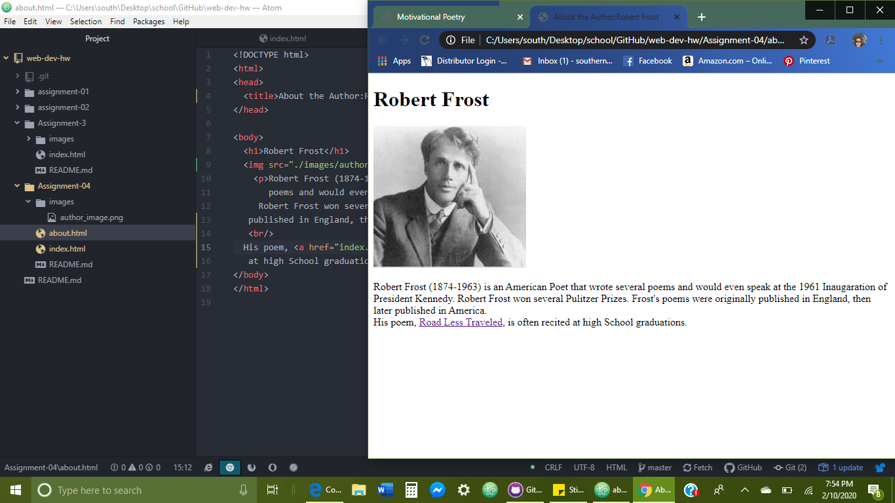

# Assignment-04
## Kate Broniste

1. The site that I visited was aol.com using The Wayback Machine.

2. Using the GIT Module I found allot easier than uploading each file in the end. I like being able to connect my files from Atom to GITHUB. The thing I struggled with the most was trying to open the repo directly into Atom from GIT. After watching the tutorial a few times, it made sense and I am now able to open my files easily.

