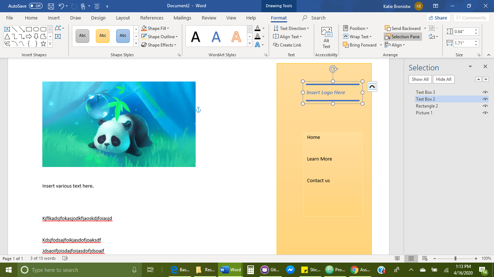
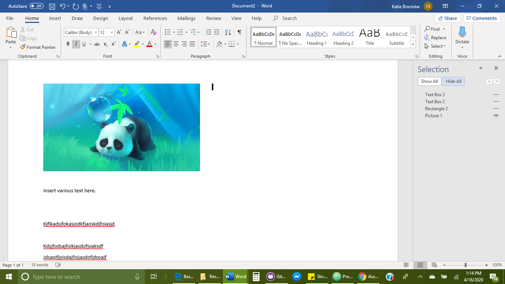

# Assignment-11

## Kate Broniste

*I have been sick all week. Tuesday went to the doctors and was tested for COVID-19. Fortunately, it was negative and I am slowly recovering. I apologize for the late assignment.*

1. What is the difference between padding, margin, and borders?

Padding - Is the amount of space between the inner content and the element.

Margin - Is the space between the box/ element and other boxes.

Borders - Adds an outline to a property.

2. Images of My Sketch.

I originally was going to have a hidden navigation bar. But in the end I decided that the fixed bar looked better.

3. My process for this Assignment included drawing out my sketch, then starting with the outline of the site. After getting the basics and outline done, I started filling in the "meat" of the website. I then began styling the page. This toik the longest.
