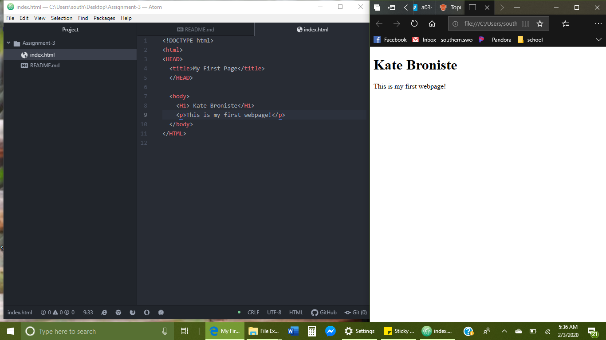

# Assignment 03

## Browser Function
Browsers function by translating the web languages into the intended layout, allowing easy view for users.  

At home I use Internet Explorer as my main browser, at work we use Google Chrome.

## Markup Language
Mark up language such as HTML, XML, and XHTML are what builds a page, with a focus on text.

